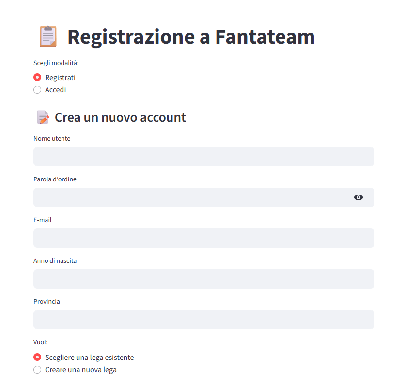
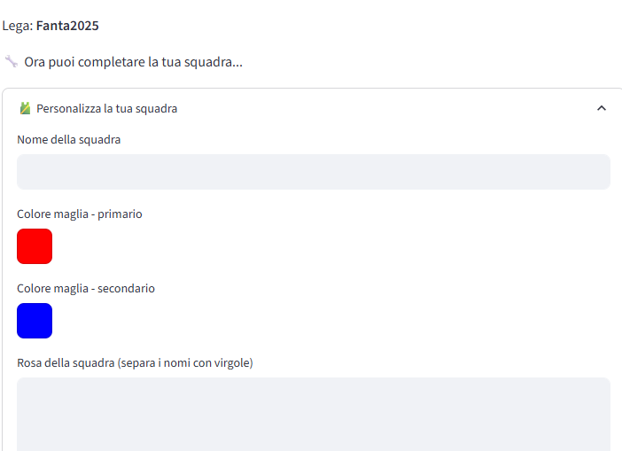

# La Fucina delle Idee - Progetti


Ciao! Sono Domenico, appassionato di tecnologia e intelligenza artificiale. Qui trovi una raccolta dei miei progetti digitali innovativi, frutto di creatività e sviluppo tecnico.


---


## Sommario

- [Fantateam](#fantateam)

- [StoryGen](#storygen)

- [Castello Kids](#castello-kids)

- [Roadmap e progressi](#roadmap-e-progressi)

- [Competenze Tecniche](#competenze-tecniche)

- [Statistiche GitHub](#statistiche-github)

- [Contatti](#contatti)


---


## Fantateam


**Stato:** In sviluppo  

**Descrizione:**  

App web che rivoluziona il fantacalcio con analisi predittive AI, consigli personalizzati per la formazione e statistiche avanzate per massimizzare le performance della tua squadra.


**Tecnologie:**  

Python, Flask, React, PostgreSQL, OpenAI API


**Come provare il progetto:**  

```bash

git clone https://github.com/Domenico374/fantateam.git

cd fantateam

# Segui le istruzioni nel file README specifico

````


### Screenshot







**Demo:** [Vai alla Demo](https://domenico374.github.io/fantateam)

**Pagina progetto:** [Fantateam su La Fucina delle Idee](https://domenico374.github.io/progetti.html#fantateam)


---


## StoryGen


**Stato:** Concept

**Descrizione:**

Generatore di storie illustrate con AI: trasforma idee in racconti visivi con testo e immagini in stile fumetto, fiaba o fotoromanzo. Ideale per aspiranti scrittori, scuole e famiglie.


**Tecnologie:**

Python, TensorFlow, React, Flask


**Pianificazione:**

Sviluppo della logica AI per generazione immagini e testo, progettazione UI e integrazione modelli NLP.


### Screenshot


*(Wireframe e mockup in arrivo)*


**Demo:** *(In arrivo)*

**Pagina progetto:** [StoryGen su La Fucina delle Idee](https://domenico374.github.io/progetti.html#storygen)


---


## Castello Kids


**Stato:** Concept

**Descrizione:**

App educativa per scuole elementari che porta i bambini alla scoperta della storia del Castello di Cagliari tramite un’avventura didattica interattiva guidata da AI.


**Tecnologie:**

Flutter, Firebase, AI integrata


**Pianificazione:**

Storyboard, definizione contenuti educativi e prime bozze UI.


### Screenshot


*(Wireframe in arrivo)*


**Demo:** *(In arrivo)*

**Pagina progetto:** [Castello Kids su La Fucina delle Idee](https://domenico374.github.io/progetti.html#castello_kids)


---


## Roadmap e progressi


* Fantateam: completamento modulo di gestione aste e integrazione API calcistiche entro Q4 2025

* StoryGen: rilascio della prima beta con editor visuale entro Q1 2026

* Castello Kids: prototipo funzionante con percorso didattico completo entro metà 2026


---


## Competenze Tecniche


* Python, Flask, React, Flutter

* AI & Machine Learning (OpenAI API, TensorFlow)

* Database (PostgreSQL, Firebase)

* UI/UX Design & Prototyping


---


## Statistiche GitHub


---


## Contatti


* 📧 [domenico.cocco@gmail.com](mailto:domenico.cocco@gmail.com)

* 🔗 [LinkedIn](https://www.linkedin.com/in/domenico-cocco-577aab83)

* 🐙 [GitHub](https://github.com/Domenico374)


---


*Contribuzioni e feedback sono sempre benvenuti!*

